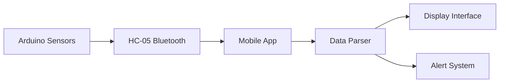

# THE WEATHER STATION

**Submitted by:**  
Imaan Soliman (Student ID: 22847545)  
Jagriti Singh (Student ID: 23839461)  
Jivitta Manivannan (Student ID: 23829398)  

**University of Northampton**  
Electronics and Computer Engineering  
Microprocessors and IoT  
**Deadline:** 26/01/2025, 23:59  

## Objective
Design and implement an IoT system using a microcontroller (ATmega328p/Arduino Uno R3) to monitor and display real-time data. Includes Tinkercad virtual prototyping with multiple sensors.

## Contents
- [Tinkercad Links and Designs](#tinkercad-links-and-designs)
- [Flowcharts](#flowchart)
- [Program Code: Tinker Cad](#program-code-arduino-tinkercad)
- [Mobile App Weather Station](#mobile-app-for-weather_station)
- [Bangle 2](#bangle-watch)
- [Demo Videos](#demo-videos)
- [Error and Obstacles](#error-and-obstacles)
- [Evaluation](#evaluation)

---

## Tinkercad Links and Designs
**Design 1**: Real-time Weather Station  
[🔗 Tinkercad Simulation Link](https://www.tinkercad.com/things/3qoFuL57TnX-weather-station/editel?returnTo=https%3A%2F%2Fwww.tinkercad.com%2Fdashboard&sharecode=in1nwahO6V74P8WeY7kbg4A0KGtVcFlFicFTHH1g1W0)  
Monitors temperature, light intensity, dew point, earthquakes, and smoke. Displays data on LCD 16x2.

**Circuit Snapshot**:  

*Diagram 1 (Accessed: January 13, 2025)*  

**Final Circuit Components**:  

*Diagram 2 (Accessed: January 13, 2025)*  

**Components**:
- **Sensors**: Temperature/Humidity, Gas (smoke), Tilt (earthquake), Light
- **Potentiometer**: LCD voltage adjustment
- **LCD**: 16x2 display
- **Pushbutton**: Mode selector
- **Piezo**: Alarm for alerts

*Diagram 3 (Accessed: January 25, 2025)*

---

# Mobile App for Weather Station

## Development Platform

**MIT App Inventor**

Used to create an interactive interface for displaying real-time weather data with Bluetooth connectivity.

## Core Functionality

- **Bluetooth Integration**: Connects to Arduino via HC-05 Bluetooth module

- **Real-time Updates**: Continuously refreshes sensor data (temperature, humidity, dew point)

- **Alert System**: Processes earthquake warnings from Arduino and displays pop-up notifications

- **Timer-driven**: Automated data polling at regular intervals

## Interface Design

*Features intuitive weather-themed design with clear data visualization*

### Frontend Components:

1. **Connection Panel**: Bluetooth device selection

2. **Data Display Area**: Shows temperature, humidity, dew point

3. **Status Indicators**: Connection status and alert notifications

4. **Theme Elements**: Weather icons and color-coded backgrounds

## Implementation Approach

### Data Flow Architecture

### Key Processes:

1. **Bluetooth Pairing**: User selects device from available list

2. **Data Reception**: Raw sensor data received via Bluetooth

3. **Data Parsing**: Splits incoming strings into temperature/humidity/dew point

4. **UI Update**: Displays values in corresponding fields

5. **Alert Handling**: Processes warning messages and triggers notifications

## Technical Challenges

### 1. Data Parsing Errors

- **Problem**: "Select list item: List index too large" errors

- **Cause**: Attempting to access non-existent list indices

- **Solution**: Added validation checks before accessing list elements

### 2. Inconsistent Data Formatting

- **Problem**: "Attempt to get item number 3 of a list of length 2"

- **Cause**: Missing delimiters in Bluetooth messages

- **Solution**: Standardized data format with strict delimiter usage

### 3. Bluetooth Connectivity Issues

- **Problem**: Intermittent disconnections and data loss

- **Cause**: Unstable Bluetooth signal and buffer overflow

- **Solution**: Implemented data chunking and connection retry logic

### Critical Components:

- **Bluetooth Controller**: Manages device connection/disconnection

- **Data Splitter**: Separates combined sensor values

- **Timer Function**: Triggers periodic data requests

- **Alert Handler**: Processes warning messages and displays notifications

*Setup for device discovery and pairing*

## User Experience Features

- **One-tap Connection**: Simple device pairing process

- **Color-coded Values**: Visual indicators for normal/warning states

- **Vibration Alerts**: Haptic feedback for warnings

- **Persistent Logging**: Stores recent readings for reference

- **Auto-reconnect**: Handles temporary disconnections seamlessly

## Final Implementation

The optimized solution provides:

- Reliable Bluetooth communication

- Accurate real-time data display

- Instant hazard notifications

- Intuitive user interface

- Robust error handling

> **Note**: The mobile app successfully communicates with the weather station hardware, though integration with the Bangle.js watch presented additional challenges not covered in this section.
---
